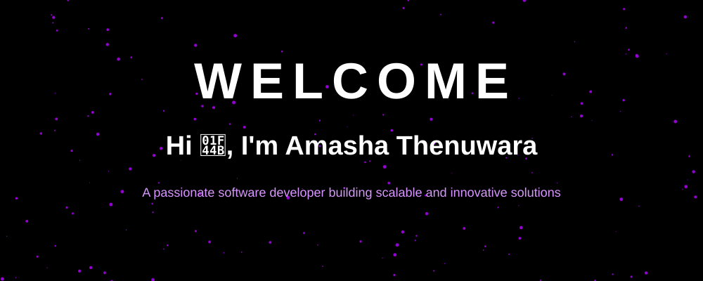

  

 
   

 

  

    
  

 

  <table>
    <tr>
      <td align="center" width="50%">
        <h3 align="center">🔮 Current Focus</h3>
        
Developing <b>TexyShield</b>, <b>AgriScout</b>, and an enterprise <b>E-Commerce Platform</b> alongside <b>Machine Learning</b> models.

      </td>
      <td align="center" width="50%">
        <h3 align="center">✨ Learning & Exploring</h3>
        
Advanced concepts in modern <b>Software Engineering</b>, <b>AI Integration</b>, and <b>Industry 4.0</b> innovations.

      </td>
    </tr>
    <tr>
      <td align="center">
        <h3 align="center">💬 Ask Me About</h3>
        
Java, Kotlin, C#, PHP, PL/SQL, Android Development, & Full-Stack Web Development.

      </td>
      <td align="center">
        <h3 align="center">📫 Let's Connect</h3>
        

          
        

      </td>
    </tr>
  </table>

 

<h3 align="left">🟣 Languages and Tools:</h3>

  <!-- We keep the original colored icons so they stand out against the dark GitHub background -->
  
  
  
  
  
  

 

 

### 👾 Featured Projects

  <table>
    <tr>
      <td></td>
      <td></td>
    </tr>
    <tr>
      <td></td>
      <td></td>
    </tr>
    <tr>
      <td></td>
      <td></td>
    </tr>
  </table>

 

  

