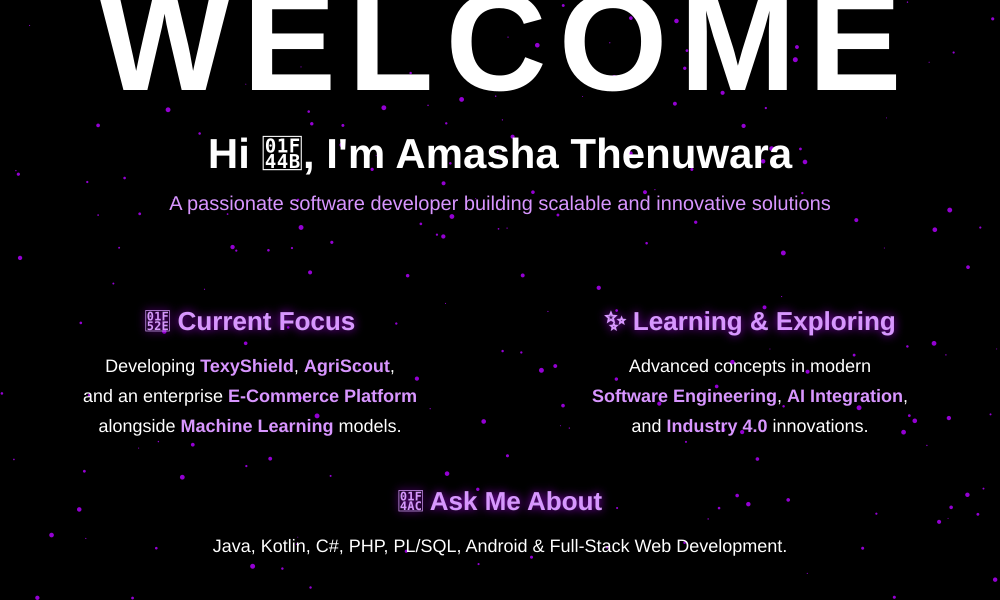
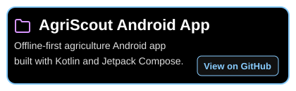
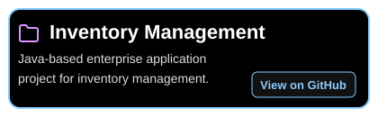

  
  
    
  
  <h3 align="center">📫 Let's Connect</h3>
  
  
    
  
  <h3 align="center">🟣 Languages and Tools</h3>
  

    
    
    
    
    
    
  

  
    

  <h3 align="center">👾 Featured Projects</h3>
   &nbsp;&nbsp;&nbsp;
  
    
   &nbsp;&nbsp;&nbsp;
  
    
   &nbsp;&nbsp;&nbsp;
  

    
  

